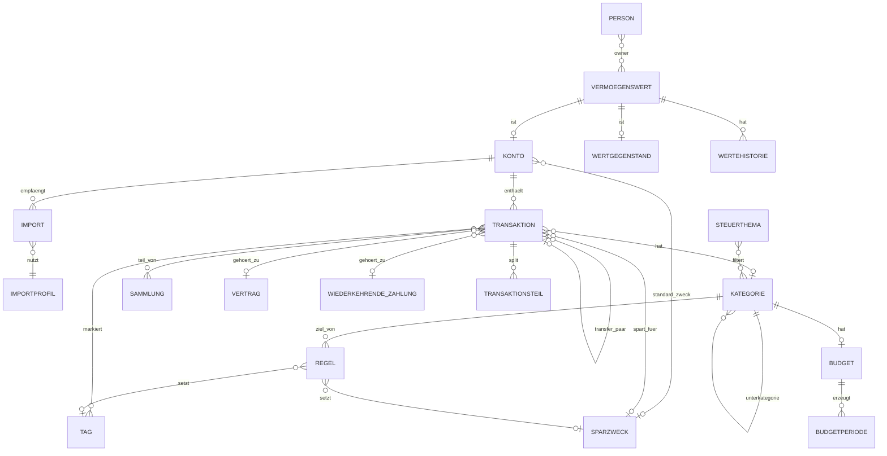

# Klarwert – Domain Model v2 (final)

Ersetzt v1 vollständig. Kompakt gehalten – die technische Präzision (Felder, Typen, Constraints, Indizes) liegt in `klarwert-schema.sql`; dieses Dokument erklärt Zweck, Beziehungen, Lifecycle und die Modellierungsentscheidungen.

## Änderungen gegenüber v1

- **Entfernt:** Ziel (ersetzt durch Sparzweck mit optionalem Zielbetrag + Sammlungs-Sparziel), Steuerprofil als Entität (→ Settings), Haushalt als Tabelle (Single-Tenant → Settings), Rechner als Entität (nur noch Szenarien), Währung pro Vermögenswert (global ein Setting).
- **Neu:** Sparzweck, Steuer-Thema, Transfer-Paar (als Attributpaar auf Transaktion), Saldo-Anker (als Wertehistorie-Quelle), Bankprofil-Fingerprints (Teil von Importprofil), Benachrichtigung erweitert.
- **Geändert:** Regel hat jetzt 1..4 kombinierbare Aktionen (Kategorie/Tag/Transfer/Sparen+Zweck) und globale Priorität; Vertrag hat Status "Pausiert"; Transaktion trägt Sparen-Flag + Sparzweck + Transfer-Paar-Referenz + externe Buchungs-ID + Fingerprint.

## Entitäten

### Person
Haushaltsmitglied zur Zuordnung, keine Zugriffskontrolle. Name, Rolle (Erwachsener/Kind, änderbar), optionales Geburtsjahr (FIRE-Rechner), aktiv-Flag (Entfernen = Soft, Daten verlieren nur Zuordnung). Mindestens eine aktive Person. n—n zu Vermögenswert (Owner).

### Vermögenswert → Konto | Wertgegenstand
Basis mit genau einer Spezialisierung (bei Anlage fix). **Konto** (Girokonto/Tagesgeld/Kreditkarte/Depot/Darlehen): Transaktionsführung, Importprofil-Referenz, letzter Import, zuletzt bestätigter Bankstand; Typen Tagesgeld/Depot/Bausparen können einen **Standard-Sparzweck** tragen (steuert die Transfer→Sparen-Automatik). **Wertgegenstand** (Bausparvertrag/Bargeld/Sonstiges): nur append-only Wertehistorie ("Wert aktualisieren"). Lifecycle: aktiv → veraltet (Erinnerungsschwelle, nur Konto) → archiviert → gelöscht (kaskadiert Transaktionen/Historie; Undo via Verlauf). Kontostand = Anker + Σ Transaktionen (Anker = Wertehistorie-Eintrag mit Quelle `anchor`, erzeugt beim Erstimport aus "aktueller Kontostand" − Σ Datei).

### Transaktion
Zentrale Bewegungs-Entität. Datum, Empfänger, Zweck, Betrag (Cents, vorzeichenbehaftet), Quelle (Import/Manuell), externe Buchungs-ID (falls Bank liefert), Fingerprint (normalisiert: Datum+Betrag+Empfänger). Kategorisierung: Kategorie-Referenz + Herkunft (manuell/regel/vertrag/keine) + auslösende Regel. Flags: geprüft, aus Statistik entfernt. **Transfer:** transfer_pair_id verknüpft beide Seiten, Status bestätigt/unbestätigt/getrennt-unterdrückt. **Sparen:** is_saving + optionaler Sparzweck. Importierte: Kernfelder gesperrt; manuelle: voll editierbar + löschbar. n—n Tags, n—n Sammlungen, n—0..1 Vertrag oder wiederkehrende Zahlung (exklusiv).

### Transaktionsteil (Split)
Schema-Hook ohne v1-UI: Aufteilung einer Transaktion auf mehrere Kategorien; Σ Anteile = Betrag, ≥2 Teile.

### Kategorie
Selbstreferenzierend (UI: 2 Ebenen). Template-Kategorien (Seed, 13 Gruppen): nicht löschbar/editierbar, nur ausblendbar; Farbe+Icon nur an Oberkategorien, Unterkategorien erben Farbe. Eigene: Stift-Marker, voll editierbar, löschbar bei 0 Nutzungen. "Unkategorisiert" = System (weder ausblendbar noch löschbar, Pipeline-Fallback). Roll-up in Auswertungen: Unterkategorie zählt auch unter ihrer Oberkategorie.

### Tag
Flaches Label, Name+Farbe, n—n Transaktion. Löschen entfernt nur Zuordnungen.

### Regel
Globale Priorität (eindeutig, Drag&Drop/Pfeile umsortierbar, neue ans Ende). Bedingungen 1..n UND (Feld × Operator [enthält/ist genau/≈±5 % nur Betrag] × Wert). Aktionen 1..4: Kategorie, Tag, Transfer-Markierung, Sparen(+Zweck). Erste zutreffende Regel gewinnt; Löschung wirkt nicht rückwirkend.

### Vertrag
Erkanntes/bestätigtes wiederkehrendes Zahlungsmuster mit Betrags-/Statuspflege. Status: NeuErkannt → Bestätigt ⇄ PreisänderungErkannt (>5 % Abweichung) → Pausiert (manuell, Erkennung eingefroren) → Beendet (2 ausbleibende Zyklen oder manuell); Trennen unterdrückt das Muster dauerhaft. Turnus monatlich/jährlich/unregelmäßig; Referenzbetrag, Vorbetrag, Kategorie. Entsteht nur automatisch (Erkennung ab 2 Perioden, Empfänger gleich, Betrag ±5 %) oder per Hochstufen.

### Wiederkehrende Zahlung
Leichtgewichtiges Muster ohne Vertragscharakter: generierter Name (umbenennbar), typischer Betrag (gleitender Ø). Aktionen: Trennen; **Hochstufen** → erzeugt bestätigten Vertrag, verschiebt Transaktionen, löscht Eintrag.

### Sammlung
Ad-hoc-Gruppierung (n—n Transaktion), optional Sparziel (Zielbetrag) und Status abgeschlossen (manuell). Zeitraum-Bulk-Zuordnung = einmalige Aktion mit Vorschau. Löschen entfernt nur Zuordnungen.

### Sparzweck
Laufender Sparstrom: Name, Farbe, optionaler Zielbetrag. Referenziert von Transaktionen (is_saving) und als Standard-Sparzweck an Konten. Fortschritt = kumulierte Sparen-Transaktionen. Löschen entfernt nur die Zweck-Zuordnung (Sparen-Flag bleibt). Defaults im Seed.

### Budget & Budgetperiode
Budget: 1 je Kategorie (Ober- XOR Unterkategorie derselben Linie), Limit >0, Zeitraum-Typ Woche/Monat/Quartal/Jahr. Budgetperiode: systemgenerierte Instanz je Zeitraum mit Limit-Snapshot; laufend live berechnet, abgeschlossen eingefroren; Historie bleibt bei Limit-Änderung/Löschung unverfälscht. Benachrichtigung bei 80 %/100 %.

### Steuer-Thema
Gespeicherter Filter für die Steuer-Seite: Name, Kategorie-Menge, Stichwort-Menge (Match auf Empfänger/Zweck), Treffer = Jahr UND (Kategorien ODER Stichwörter). Defaults im Seed, frei editier-/erweiterbar. Keine Steuerlogik.

### Dashboard-Widget
Ein Datensatz je Widget-Typ: sichtbar-Flag, feste Reihenfolge, config (z. B. Personen-Vergleich-Metrik). Nutzer legt nichts an/löscht nichts.

### Import & Importprofil
Import: Protokoll je Vorgang (Datei, Modus Aktualisieren/Komplett-neu, Ergebniszahlen, Status, Fehler); transaktional. Importprofil: Spaltenzuordnung + Trennzeichen + Formate + **Header-Fingerprint** (Auto-Erkennung); mitgelieferte Bankprofile als `is_builtin` (Seed), eigene entstehen automatisch beim manuellen Mapping.

### Export
Protokoll: Typ (Backup-JSON / Transaktions-CSV / Steuer-CSV), Zeitraum, Zeitpunkt. Backup trägt Schema-Version; Import prüft Kompatibilität.

### Rechner-Szenario
Gespeicherter Lauf: Rechnertyp (fire/zinseszins/entnahme), Name, Inputs-JSON, Ergebnis-Snapshot-JSON, Zeitpunkt.

### Benachrichtigung
Persistent: Typ (R14 der Spec), polymorphe Bezugsreferenz, Text, Priorität (Info/Warnung/Kritisch), gelesen/archiviert. Upsert je Typ+Bezug; Auto-Archiv bei behobener Ursache. UI: Glocke + Popover.

### Änderungsverlauf-Eintrag
Undo-Protokoll für Bulk/Regel-Anwendung/Löschungen: Beschreibung, Payload für Wiederherstellung, rückgängig-Flag (30 Tage/50 Aktionen).

### Settings (Key-Value)
currency, import_reminder_days, kirchensteuer_aktiv, kirchensteuer_satz, onboarding_done, active_db (real/demo als App-State, nicht in der DB selbst).

## ER-Überblick

## Modellierungsbegründung (Kurzform)

**Sparzweck statt Ziel-Entität:** Der reale Bedarf ("Sparen für Rente/Kind/Haus unterscheidbar auswerten") ist ein Attribut laufender Geldströme, keine abstrakte Planungsklammer. Sparzweck+Zielbetrag deckt das direkt; Sammlungs-Sparziele bleiben separat für einmalige Projekte. Die frühere Ziel-Entität hätte eine dritte Indirektion ohne v1-Nutzen eingeführt.
**Transfer als Attributpaar statt eigener Entität:** Ein Transfer ist genau zwei Transaktionen; eine Paar-Referenz + Status genügt und hält Abfragen trivial ("beide Seiten via transfer_pair_id").
**Anker als Wertehistorie-Quelle:** kein neues Konstrukt – der Startsaldo ist ein Historien-Eintrag mit Quelle `anchor`, damit funktionieren Vermögenskurve und Saldo-Formel ohne Sonderfall.
**Steuer-Thema als gespeicherter Filter:** exakt die gewünschte "Menü zum gezielten Durchsuchen"-Semantik, ohne Steuer-Eigenschaft an der Transaktion und ohne Steuerrecht im Code.
**Regel mit kombinierbaren Aktionen:** eine Pipeline, ein Editor, ein Prioritätsmodell für Kategorie, Tag, Transfer und Sparen – statt vier paralleler Automatik-Systeme.
